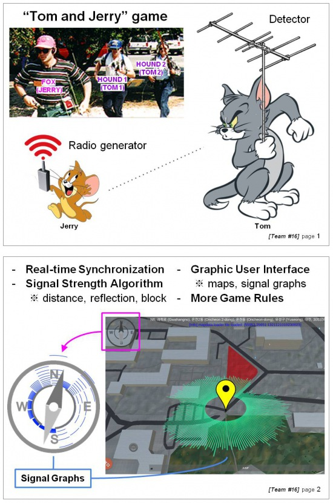

# Tom-and-Jerry Simulation ([Transmitter Hunting](https://en.wikipedia.org/wiki/Transmitter_hunting))
Implementation of virtual gears required for the sport called the Foxhunt game where ‘hounds’ hunt down ‘a fox’ by observing the virtual signal calculated from a signal simulation using real GPS and Map data using mobile smartphones and multi-core processing server. We renamed to Tom-and-Jerry game for intuitive understanding of this game.

## Presentation
* **[6/5] Final Presentation (EOSP)**: click to play the video on YouTube.

[](https://www.youtube.com/watch?v=EyGnM-HKcuA "End of Semester Presentation")

* **[4/10] Interim Presentation(MOSP)**: click to play the video on YouTube.

[](https://www.youtube.com/watch?v=RQ_oRsLWNQ4 "Middle of Semester Presentation")

* **Signal Simulation Development Footage**: click to play the video on YouTube.

[](https://www.youtube.com/watch?v=Y0MLaJUGkLo "Signal Simulation")

* **App Alpha Test**: click to play the video on YouTube.

[](https://www.youtube.com/watch?v=ayTxKpPJf4c "App Alpha Test")


## Introduction


## Documents
* [2017/03/20] - [Idea pitching]([2017.3.20]_idea_pitching.pdf)
* [2017/04/05] - [Project document]([2017.4.05]_project_document.pdf)
* [2017/04/10] - [MOSP (Interim Presentation)]([2017.4.10]_middle_of_semester_presentation.pdf)
* [2017/05/10] - [Revised Project document]([2017.5.10]_revised_project_document.pdf)

## Installation
### OSM crawling

1. Install [BeautifulSoup](https://www.crummy.com/software/BeautifulSoup/bs4/doc/#installing-beautiful-soup).

	```
	$ pip install beautifulsoup4
	```
	
2. Export [OpenStreetMap](http://www.openstreetmap.org/export) data that will be used.
3. Run our [Python Code](OSMcrawling/MapData_Crawling.py).
4. Then you can get the results: (e.g.)

	```
	i	949	117	4
	# nodes
	n	36.3673981	127.3637097
	n	36.3674462	127.3638063
	n	36.3677069	127.3643303
	n	36.3675444	127.364455
	n	36.3674521	127.3642694
	n	36.3674026	127.3641699
	n	36.3672357	127.3638344
	b E2-2	0	1	2	3	4	5	6	0
	```
	
	first line: i, #of nodes, #of buildings, #of forests
	

### OpenCL-[NVIDIA CUDA](https://developer.nvidia.com/cuda-downloads)
OpenCL should be installed based on your graphics processing unit (GPU). (e.g. AMD, NVIDIA) We are using CUDA from NVIDIA in this project.


### Online realtime signal simulation prototyping
We used node.js, socket.io, and pixi.js. (see WebGraphic and SeqProgram for this)

```javascript
function runCalculation(){
	var prog = "SeqProgram.exe " + position.gx + " " + position.gy + " " + position.ax + " " + position.ay;
	exec(prog, (err, stdout, stderr) => {
		if (err) {
			console.error(err);
			return;
		}
		signal = JSON.parse(stdout);
	});
}
runCalculation(); //initalize
```

### [Firebase](https://firebase.google.com/)
Our team used firebase for user authorization and realtime signal data synchronization.

	
## Signal Simulation Development Footage
* [4/22] Reflection Simulation on: # of signal:360

[](https://www.youtube.com/watch?v=6H-wo_vZulA "Signal Simulation")

* [4/25] Signal blocking by forests on KAIST MAP

[](https://www.youtube.com/watch?v=OocRdbA8gdY "Signal blocking by forests")

* [4/29] Signal reflectionon KAIST MAP (sig#3600, long double, sequential)

[](https://www.youtube.com/watch?v=gqyN_1NY7mE "Signal reflection")

* [4/30] Signal reflectionon KAIST MAP (sig#3600, 64bit int, sequential, fixed bug)

[](https://www.youtube.com/watch?v=A-gF2tzhoB0 "Signal reflection")

* **[5/1] Signal reflectionon KAIST MAP**

	- Number of signals : 172032, max reflection: 10
	
	- Using GPU: NVIDIA GeForce GTX 650 Ti

[](https://www.youtube.com/watch?v=2uKSR1LshKs "Signal reflection")

* **[5/8] Web Online Realtime Graphical Simulation**

[](https://www.youtube.com/watch?v=h7f6DAYvjwM "Signal Simulation Web Socket")

* **[6/5] Signal Simulation Development**

[](https://www.youtube.com/watch?v=Y0MLaJUGkLo "Signal Simulation Development")

* **[6/5] Transmitter Hunting DEMO**

[](https://www.youtube.com/watch?v=ayTxKpPJf4c "Transmitter Hunting DEMO")

